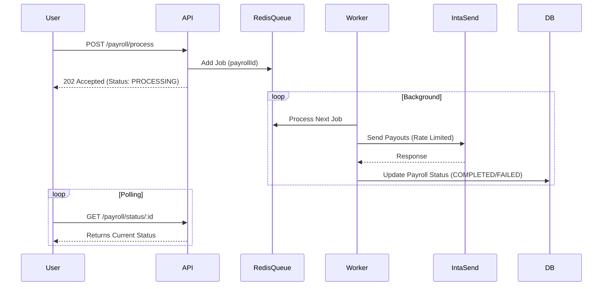

# Concurrent Payment Handling Strategy

## Problem Analysis
The current implementation processes payroll payouts synchronously within the HTTP request lifecycle.
-   **Risk 1 (Rate Limiting)**: 100 concurrent users with 10 workers each = 1,000 outgoing API calls. This will likely trigger "Too Many Requests" errors from IntaSend.
-   **Risk 2 (Server Load)**: Node.js event loop logic is efficient, but holding 100 open requests while waiting for 3rd party APIs is risky.
-   **Risk 3 (User Experience)**: The `AppThrottlerModule` (limit: 10 req/sec) will reject 90% of users if they all click "Index" at the exact same second.

## Proposed Solution: Asynchronous Queue Architecture

Transition from **Synchronous Processing** to **Asynchronous Job Queues**.

### 1. Architecture Changes
Introduce `BullMQ` (Redis-based queue) to handle payment processing in the background.



### 2. Implementation Steps

#### Phase 1: Infrastructure
1.  Install `@nestjs/bull` and `bull`.
2.  Configure `BullModule` in `AppModule` using the existing Redis connection.

#### Phase 2: Refactoring Payroll Service
1.  Create `PayrollProcessor` class (Consumer).
2.  Move the logic from `PayrollService.finalizePayroll` (specifically the payout part) into the processor.
3.  Update `PayrollController.process` to only:
    -   Validate the request.
    -   Set PayPeriod status to `PROCESSING`.
    -   Add job to queue.
    -   Return immediate success.

#### Phase 3: Rate Limiting
Configure Bull queue with rate limits matching IntaSend's constraints (e.g., max 10 jobs per second).

```typescript
BullModule.registerQueue({
  name: 'payouts',
  limiter: {
    max: 5, // Process max 5 jobs
    duration: 1000, // per second
  },
});
```

### 3. Handling 100 Users (Simulation)
With this setup:
1.  100 Users click "Run".
2.  API accepts all 100 requests instantly (assuming incoming throttler allows bursts, or we increase the limit).
3.  100 Jobs go into Redis.
4.  The Worker processes them 5 at a time (or whatever safe rate we set).
5.  Users see a "Processing..." spinner which resolves to "Completed" as their job finishes.
6.  **Result**: Zero dropped requests, Zero upstream rate limit errors.

## Immediate Action Items
1.  Increase `AppThrottler` "short" limit to ~50-100 to accommodate bursts of user activity, or implement a "Queue-it" style wait room if strictly necessary (likely overkill for 100 users).
2.  Update `docs/payroll_process_flow.md` to reflect this async nature (already partly done).
3.  **Recommendation**: Implement this Queue architecture before going live with >10 users.
