# Payment Status Visibility

This document describes the payment status feature that provides real-time feedback to employers during payroll disbursements.

## Overview

When payroll payments are sent via M-Pesa (through IntaSend), the system tracks each payment's status and notifies the employer as it progresses:

| Status | Icon | Description |
|--------|------|-------------|
| **Pending** | 🟡 | Payment initiated, awaiting processing |
| **Processing** | 🔵 | Payment submitted to M-Pesa |
| **Clearing** | 🔵 | M-Pesa sent, awaiting settlement confirmation |
| **Paid** | 🟢 | Payment successfully delivered to worker |
| **Failed** | 🔴 | Payment failed - retry required |

## How Status Updates Work

```mermaid
sequenceDiagram
    participant IntaSend
    participant Backend
    participant FCM as Push Service
    participant Mobile

    Note over Backend: 1. Employer finalizes payroll
    Backend->>IntaSend: B2C payment request
    IntaSend-->>Backend: tracking_id

    Note over IntaSend: 2. IntaSend processes payment
    IntaSend->>Backend: Webhook (CLEARING)
    Backend->>Backend: Update Transaction.status
    Backend->>FCM: sendPaymentStatusNotification()
    FCM->>Mobile: "⏳ Payment Clearing"

    Note over IntaSend: 3. M-Pesa confirms
    IntaSend->>Backend: Webhook (COMPLETE)
    Backend->>Backend: Update Transaction.status
    Backend->>FCM: sendPaymentStatusNotification()
    FCM->>Mobile: "✅ Payment Complete"
```



**Key Point**: IntaSend *pushes* status updates to us via webhooks. We don't poll.

## Push Notifications

Employers receive push notifications at each status change:

| Status | Title | Message |
|--------|-------|---------|
| PENDING | 💳 Payment Initiated | Payment of KES X to Worker is processing |
| CLEARING | ⏳ Payment Clearing | Payment to Worker sent to M-Pesa, awaiting confirmation |
| SUCCESS | ✅ Payment Complete | KES X successfully sent to Worker |
| FAILED | ❌ Payment Failed | Payment to Worker failed. Please check and retry |

## API Endpoints

### Get Payment Status for Pay Period
```
GET /payroll-records/pay-period/:payPeriodId/status
```

**Response:**
```json
[
  {
    "id": "uuid",
    "workerId": "uuid",
    "workerName": "John Doe",
    "netPay": 45000,
    "paymentStatus": "paid",
    "paymentDate": "2026-01-19T10:30:00Z"
  }
]
```

## UI Component: PaymentStatusBadge

A reusable Flutter widget displays the payment status with appropriate colors:

```dart
PaymentStatusBadge(status: 'paid', compact: true)
```

The badge is integrated into `WorkerBreakdownCard` on the payroll review page.

## Related Files

**Backend:**
- `payments.controller.ts` - IntaSend webhook handler with push notification
- `notifications.service.ts` - `sendPaymentStatusNotification()` method
- `payroll-records.controller.ts` - Status endpoint

**Mobile:**
- `payment_status_badge.dart` - Reusable status badge widget
- `payroll_review_widgets.dart` - `WorkerBreakdownCard` with status display
- `payroll_repository.dart` - `getPaymentStatus()` method
