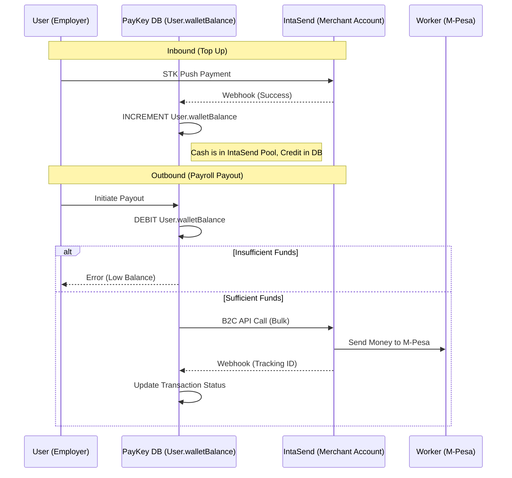
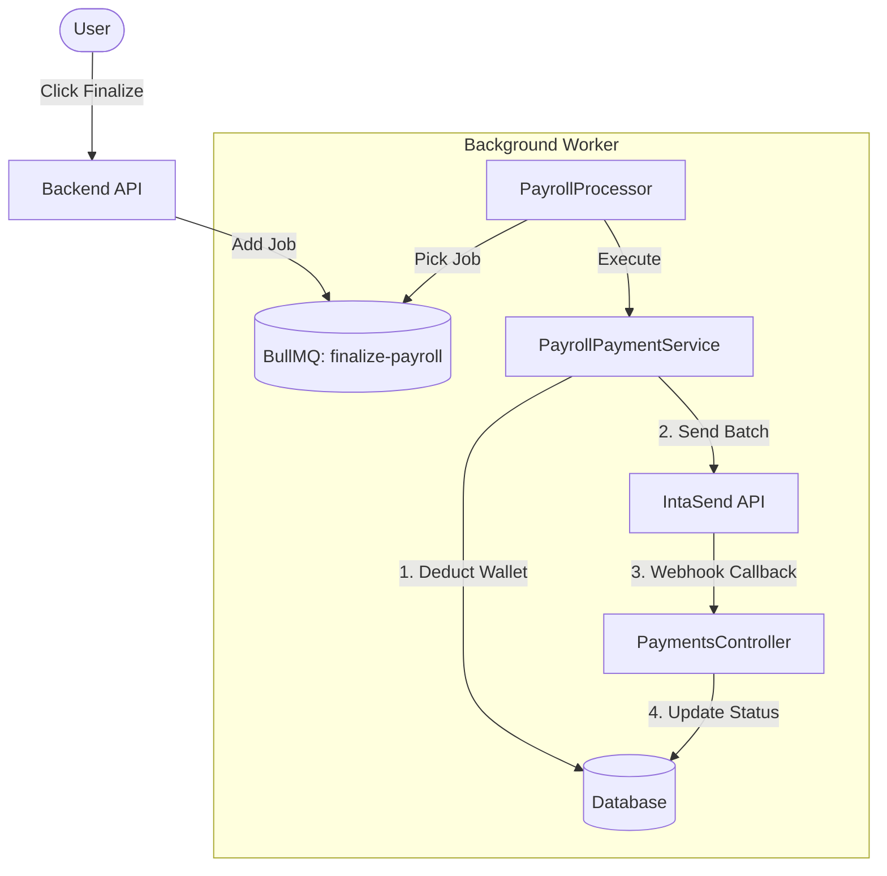

# IntaSend System Architecture & Integration Guide

## 1. Core Concept: The "Two-Layer" Wallet Model

A critical architectural distinction in PayKey is the difference between the **Company Funds** and the **User Wallet**.

### The Flow of Funds

1.  **Collection (Inbound)**: 
    *   **User Action**: Initiates M-Pesa STK Push.
    *   **Actual Money Flow**: Moves from User's M-Pesa --> **PayKey's IntaSend Merchant Account** (Global Pool).
    *   **System Logic**: We credit the individual `User.walletBalance` in our **local database**. 
    *   *Result*: PayKey holds the cash; the User holds a digital credit in our system.

2.  **Disbursement (Outbound)**:
    *   **User Action**: Initiates Payroll Payout (B2C).
    *   **System Logic**: We check the **local** `User.walletBalance`. If sufficient, we debit the local ledger *first*.
    *   **Actual Money Flow**: We trigger an API call to IntaSend to move money from **PayKey's IntaSend Merchant Account** --> Worker's M-Pesa.
    *   *Result*: Funds leave the company pool. If the API call fails, we refund the local credit.

> **Important**: We do **not** use IntaSend's "Sub-Wallets" feature. To IntaSend, we are one big merchant. The segregation of funds is entirely logical within PayKey's database.

### Mermaid Diagram: Funds Flow

---

## 2. Integration Features

### Bulk B2C Payouts
*   **Endpoint**: `POST /payments/process` (via `PayrollPaymentService`)
*   **Mechanism**: 
    1.  aggregates payments into batches of 10.
    2.  Debits the user's local wallet for the *total batch amount*.
    3.  Sends a single bulk request to IntaSend.
    4.  Stores the IntaSend `tracking_id` as the `providerRef` for all transactions in the batch.
*   **Error Handling**: If the bulk request fails immediately, the local wallet is automatically refunded.

### Webhook Handling (`PaymentsController`)
We use a robust, idempotent webhook handler to track transaction statuses.
*   **Signature Verification**: All webhooks are verified using `HMAC-SHA256` against the `INTASEND_SECRET_KEY`. Unverified requests are rejected (401).
*   **Dual Lookup**:
    *   **Collections**: Matched by `invoice_id`.
    *   **Payouts (Bulk)**: Matched by `tracking_id`. The handler updates *all* transactions sharing the same `tracking_id`.
*   **Idempotency**: If a transaction is already marked `SUCCESS` or `FAILED`, the webhook is ignored to prevent duplicate processing (e.g., double-crediting a wallet).

### Status Polling
*   **Endpoint**: `GET /payments/intasend/status/:trackingId`
*   **Purpose**: Allows manual verification of a payout batch if webhooks are delayed or missed.
*   **Source**: Queries IntaSend's status API directly.

---

## 3. Configuration & Security

### Environment Variables
*   `INTASEND_PUBLISHABLE_KEY` / `INTASEND_SECRET_KEY`: Live credentials.
*   `INTASEND_PUBLISHABLE_KEY_TEST` / `INTASEND_SECRET_KEY_TEST`: Sandbox credentials.
*   `INTASEND_IS_LIVE`: Set to `true` to force Live mode; otherwise defaults to Test/Sandbox.

### Security Best Practices
1.  **Deduction First**: Always debit the local ledger *before* calling the external API.
2.  **Signature checks**: Never trust a webhook payload without verifying the `X-IntaSend-Signature` header.
3.  **No Client-Side Secrets**: IntaSend keys are never exposed to the Flutter mobile app.

---

## 4. Asynchronous Processing (BullMQ)

To ensure system stability during large payroll runs, we do **not** process payments synchronously in the API request.

1.  **Trigger**: The user clicks "Finalize Payroll" in the UI.
2.  **Job Queue**: The backend pushes a `finalize-payroll` job to the **BullMQ** queue.
3.  **Worker Execution**: 
    *   The `PayrollProcessor` picks up the job.
    *   It calls `PayrollService.executePayrollFinalization`.
    *   This internally calls `PayrollPaymentService.processPayouts` to execute the **Bulk B2C** logic described above.
4.  **Completion**: Once the queue finishes processing, the payroll is marked as `FINALIZED` (or `PARTIALLY_PAID` if errors occur).

This architecture prevents timeout errors on the frontend when processing hundreds of payouts simultaneously.

### Mermaid Diagram: Async Processing

---

## 5. Troubleshooting

*   **"Transaction Not Found" in Webhook**: 
    *   Check if it's a B2C batch. If so, ensure the webhook payload contains `tracking_id` and the code is searching by `providerRef`.
*   **Wallet Balance Mismatch**: 
    *   The `GET /wallet` endpoint returns the **Local** User Balance. If this doesn't match expectations, check the `transactions` table for failed webhooks or manual adjustments.
