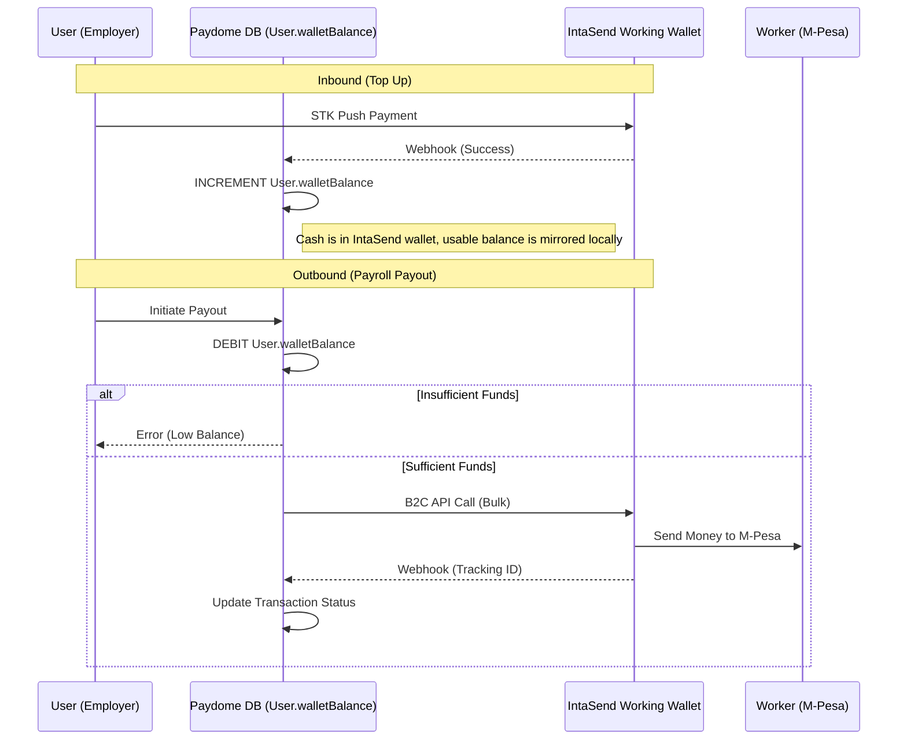
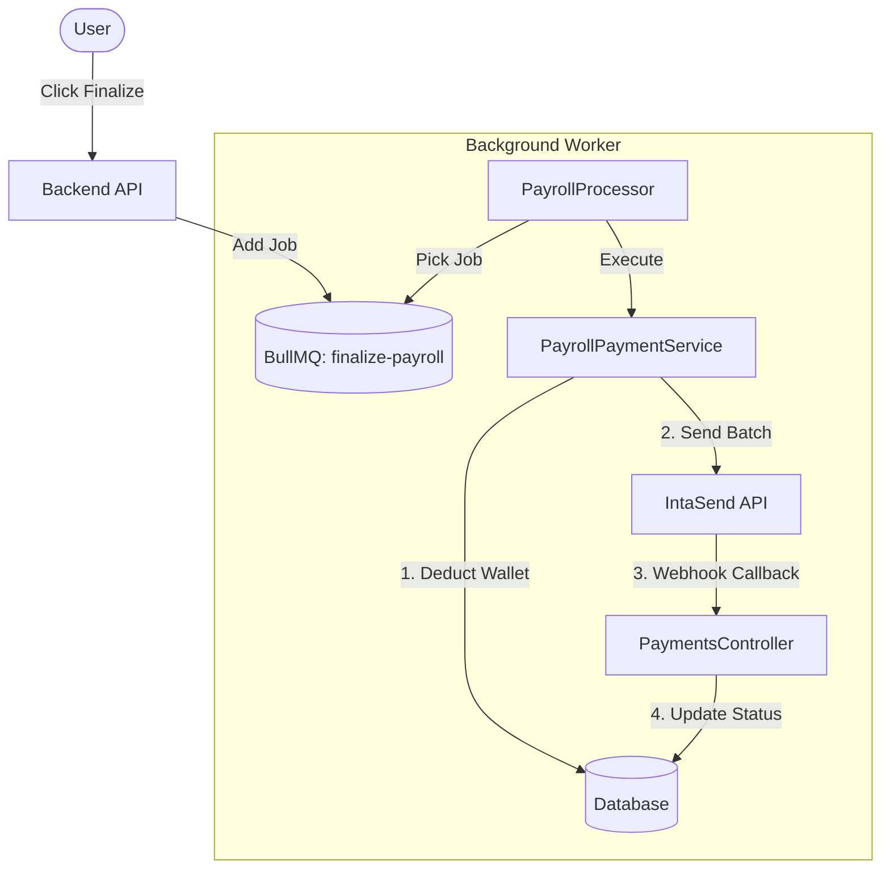

# IntaSend System Architecture & Integration Guide

## 1. Core Concept: Working Wallets plus Local Ledger

Paydome keeps each employer on a dedicated IntaSend WORKING wallet and also keeps
a local ledger in `User.walletBalance`. The IntaSend wallet is the payment rail;
the local ledger is the product source of truth used before payroll is released.

### The Flow of Funds

1.  **Collection (Inbound)**:
    *   **User Action**: Initiates M-Pesa STK Push.
    *   **Actual Money Flow**: Moves from User's M-Pesa --> the employer's IntaSend WORKING wallet when `wallet_id` is provided.
    *   **System Logic**: We credit the individual `User.walletBalance` in our local database after the IntaSend webhook confirms success.
    *   *Result*: IntaSend holds the cash in the employer wallet; Paydome mirrors usable balance locally.

2.  **Disbursement (Outbound)**:
    *   **User Action**: Initiates Payroll Payout (B2C).
    *   **System Logic**: We check the **local** `User.walletBalance`. If sufficient, we debit the local ledger *first*.
    *   **Actual Money Flow**: We trigger an API call to IntaSend to move money from the employer's IntaSend wallet --> Worker's M-Pesa or bank account.
    *   *Result*: Funds leave the employer wallet. If the API call fails, we refund the local credit.

> **Important**: Do not bypass the payroll payout flow in production. It is the
> path that creates audit transactions, deducts local balance first, sends the
> IntaSend batch, and reconciles webhook/status results safely.

### Mermaid Diagram: Funds Flow

```mermaid
sequenceDiagram
    participant U as User (Employer)
    participant PK as Paydome DB (User.walletBalance)
    participant IS as IntaSend Working Wallet
    participant W as Worker (M-Pesa)

    Note over U, IS: Inbound (Top Up)
    U->>IS: STK Push Payment
    IS-->>PK: Webhook (Success)
    PK->>PK: INCREMENT User.walletBalance
    Note right of PK: Cash is in IntaSend wallet, usable balance is mirrored locally

    Note over U, IS: Outbound (Payroll Payout)
    U->>PK: Initiate Payout
    PK->>PK: DEBIT User.walletBalance
    alt Insufficient Funds
        PK-->>U: Error (Low Balance)
    else Sufficient Funds
        PK->>IS: B2C API Call (Bulk)
        IS->>W: Send Money to M-Pesa
        IS-->>PK: Webhook (Tracking ID)
        PK->>PK: Update Transaction Status
    end
```

---

## 2. Integration Features

### Bulk B2C Payouts
*   **Endpoint**: `POST /payments/process` (via `PayrollPaymentService`)
*   **Mechanism**: 
    1.  aggregates payments into batches of 10.
    2.  Debits the user's local wallet for the *total batch amount*.
    3.  Sends a single bulk request to IntaSend with `requires_approval: 'NO'`.
    4.  Stores the IntaSend `tracking_id` as the `providerRef` for all transactions in the batch.
*   **Error Handling**: If the bulk request fails immediately, the local wallet is automatically refunded.

### Webhook Handling (`PaymentsController`)
We use a robust, idempotent webhook handler to track transaction statuses.
*   **Verification**: Webhooks are verified with the IntaSend dashboard challenge (`INTASEND_CHALLENGE`) and can fall back to `X-IntaSend-Signature` HMAC verification.
*   **Dual Lookup**:
    *   **Collections**: Matched by `invoice_id`.
    *   **Payouts (Bulk)**: Matched by `tracking_id`. The handler updates *all* transactions sharing the same `tracking_id`.
*   **Itemized Statuses**: Send-money webhook `transactions[]` are inspected before marking payroll records paid. Mixed or uncertain item results are marked `manual_check`.
*   **Idempotency**: If a transaction is already marked `SUCCESS`, `FAILED`, or `MANUAL_INTERVENTION`, the webhook is ignored to prevent duplicate processing.

### Status Polling
*   **Endpoint**: `GET /payments/intasend/status/:trackingId`
*   **Purpose**: Allows manual verification of a payout batch if webhooks are delayed or missed.
*   **Source**: Queries IntaSend's status API directly.
*   **Access**: Requires authentication and a transaction owned by the requesting employer.

---

## 3. Configuration & Security

### Environment Variables
*   `INTASEND_PUBLISHABLE_KEY` / `INTASEND_SECRET_KEY`: Live credentials.
*   `INTASEND_PUBLISHABLE_KEY_TEST` / `INTASEND_SECRET_KEY_TEST`: Sandbox credentials.
*   `INTASEND_IS_LIVE`: Set to `true` to force Live mode; otherwise defaults to Test/Sandbox.
*   `INTASEND_HOST_URL`: Public site URL used in checkout/STK payloads.
*   `INTASEND_CHALLENGE`: Challenge configured in the IntaSend webhook dashboard.

### Security Best Practices
1.  **Deduction First**: Always debit the local ledger *before* calling the external API.
2.  **Webhook checks**: Never trust a webhook payload without verifying the configured IntaSend challenge or signature.
3.  **No Client-Side Secrets**: IntaSend keys are never exposed to the Flutter mobile app.

---

## 4. Asynchronous Processing (BullMQ)

To ensure system stability during large payroll runs, we do **not** process payments synchronously in the API request.

1.  **Trigger**: The user clicks "Finalize Payroll" in the UI.
2.  **Job Queue**: The backend pushes a `finalize-payroll` job to the **BullMQ** queue.
3.  **Worker Execution**: 
    *   The `PayrollProcessor` picks up the job.
    *   It calls `PayrollService.executePayrollFinalization`.
    *   This internally calls `PayrollPaymentService.processPayouts` to execute the **Bulk B2C** logic described above.
4.  **Completion**: Once the queue finishes processing, the payroll is marked as `FINALIZED` (or `PARTIALLY_PAID` if errors occur).

This architecture prevents timeout errors on the frontend when processing hundreds of payouts simultaneously.

### Mermaid Diagram: Async Processing

```mermaid
graph TD
    User([User]) -->|Click Finalize| API[Backend API]
    API -->|Add Job| Queue[(BullMQ: finalize-payroll)]
    
    subgraph Background Worker
        Worker[PayrollProcessor] -->|Pick Job| Queue
        Worker -->|Execute| Service[PayrollPaymentService]
        
        Service -->|1. Deduct Wallet| DB[(Database)]
        Service -->|2. Send Batch| IntaSend[IntaSend API]
        
        IntaSend -->|3. Webhook Callback| Controller[PaymentsController]
        Controller -->|4. Update Status| DB
    end
```

---

## 5. Troubleshooting

*   **"Transaction Not Found" in Webhook**: 
    *   Check if it's a B2C batch. If so, ensure the webhook payload contains `tracking_id` and the code is searching by `providerRef`.
*   **Wallet Balance Mismatch**: 
    *   The `GET /wallet` endpoint returns the **Local** User Balance. If this doesn't match expectations, check the `transactions` table for failed webhooks or manual adjustments.
