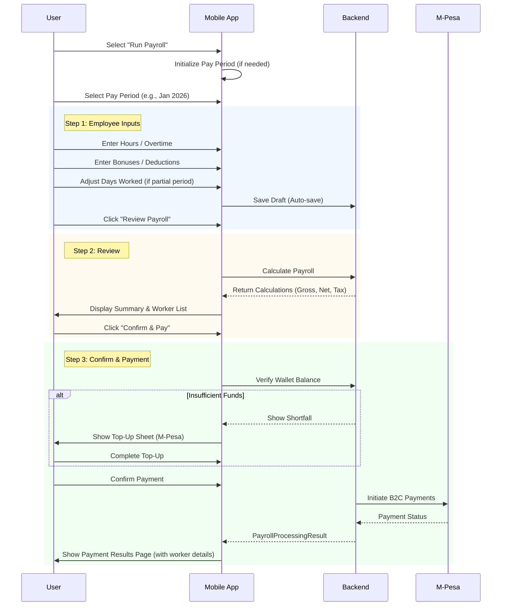
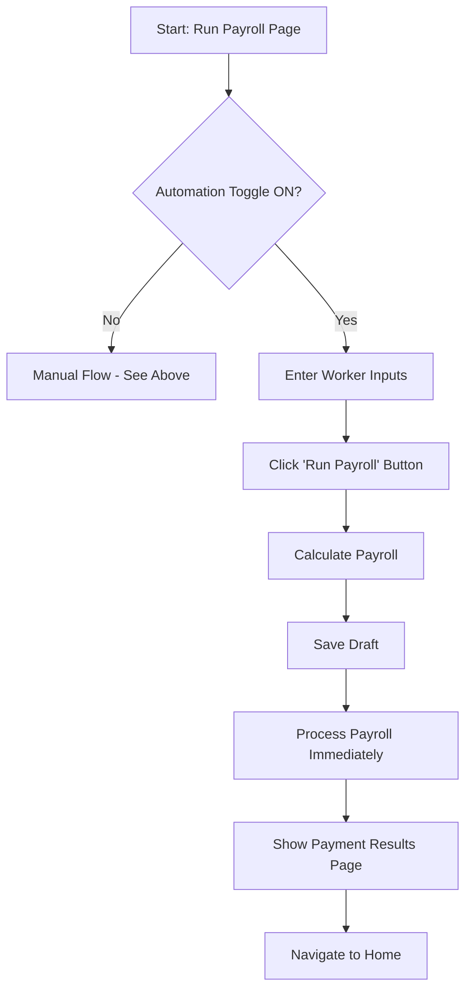
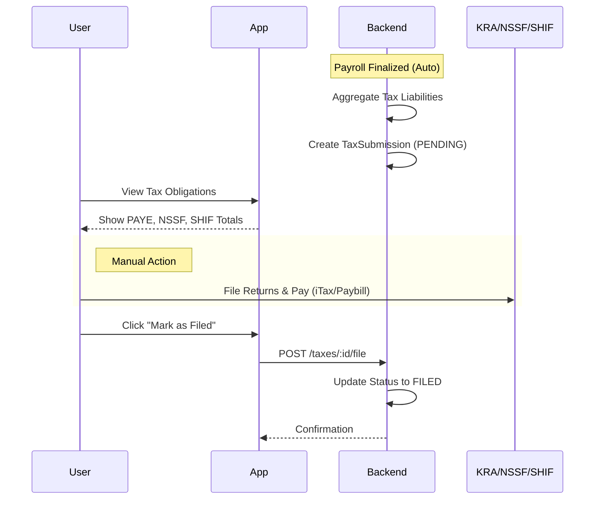

# Payroll Process Flow

This document outlines the workflow for running payroll in PayKey, covering both Manual and Automated processes.

## 1. Manual Payroll Process
This is the standard flow where the user manually reviews and initiates payments.



### Manual Flow Pages
| Step | Page | Route | Description |
|------|------|-------|-------------|
| 1 | `RunPayrollPageNew` | `/payroll/run` | Hours, overtime, bonuses, deductions, days worked |
| 2 | `PayrollReviewPage` | `/payroll/review/:id` | Tax breakdown, net pay calculations |
| 3 | `PayrollConfirmPage` | `/payroll/confirm/:id` | Wallet verification, top-up, final payment |

---

## 2. Automated Payroll Process
This flow allows "One-Click" processing for salaried employees with no variations.



### Key Differences from Manual Flow

| Aspect | Manual Flow | Automated Flow |
|--------|-------------|----------------|
| **Review Step** | Shows `PayrollReviewPage` with full breakdown | ⚡ Skipped entirely |
| **Confirmation** | `PayrollConfirmPage` with wallet check & top-up | ⚡ Skipped entirely |
| **Result Display** | `PaymentResultsPage` with per-worker status | ✅ Same `PaymentResultsPage` |
| **Failure Handling** | Shows failed workers, allows retry | ✅ Same behavior |
| **Best For** | Complex payrolls, first-time runs | Fixed-salary, recurring runs |

> [!TIP]
> Both flows now use the same `PaymentResultsPage` to display per-worker success/failure details.
> Users can see exactly which payments failed and why.

---

## 3. Proration & Partial Periods

### When Proration Applies
The app automatically detects and handles partial pay periods:

| Scenario | Detection | Default Days |
|----------|-----------|--------------|
| **New Hire** | `worker.startDate` after period start | Days from start to period end |
| **Termination** | `worker.terminatedAt` before period end | Days from period start to termination |
| **Deceased** | Same as termination | May be 0 if not reported in time |
| **Leave of Absence** | Manual entry required | User enters actual days |

### UI Behavior

```
┌─ Normal Worker ────────────────────────────┐
│ [Hours] [Overtime] [Bonuses] [Deductions]  │  ← No days field shown
└────────────────────────────────────────────┘

┌─ Terminated Worker ──────────────⚠️ Orange ─┐
│ ⚠️ 15 / 31 days                             │  ← Badge visible
├─────────────────────────────────────────────┤
│ Days Worked:                                │
│ ● Full Period (31 days)                     │
│ ○ Partial: [15] / 31                        │  ← Editable input
│                                             │
│ Prorated: KES 50,000 × (15/31) = KES 24,193│
└─────────────────────────────────────────────┘
```

### Proration Formula
```
Prorated Salary = Monthly Salary × (Days Worked / Total Days in Period)
```

### Payload Sent to Backend
```json
{
  "workerId": "uuid",
  "grossSalary": 24193.55,
  "bonuses": 0,
  "otherDeductions": 0,
  "daysWorked": 15,
  "totalDaysInPeriod": 31
}
```

---

## 4. Post-Payroll Actions

Once payroll is **Finalized**:
1.  **Payslips**: Generated automatically and available for download.
2.  **Reports**: Tax returns (P10, SHIF excel) are generated.
3.  **History**: Records are locked and moved to "History" tab.

## 5. Status Usage

| Status | Display Name | Meaning |
| :--- | :--- | :--- |
| `DRAFT` | **Draft** | Inputs are being entered. Editable. |
| `PROCESSING` | **Processing** | Calculations/Allocations in progress. |
| `COMPLETED` | **Finalized** | Payroll calculated, paid (if applicable), and payslips generated. |
| `CLOSED` | **Archived** | Optional manual state. Permanently locked. |

## 6. Key Components

### Reusable Widgets (from refactored `payroll_confirm` module)
- `WalletBalanceCard` - Shows balance, shortfall, top-up button
- `MpesaTopupSheet` - M-Pesa top-up bottom sheet
- `PaymentResultsPage` - Per-worker payment results with success/failure
- `WorkerPayrollCard` - Worker input card with optional proration UI

### Controller Management
  - Hours, Overtime, Bonuses, Deductions
  - **Days Worked** - with smart defaults based on worker status

---

## 7. Tax Submission Workflow

The system handles the **calculation** and **tracking** of tax liabilities automatically, but the **filing** and **payment** to authorities is currently a manual process.



### Steps Description

1.  **Automatic Generation**:
    *   Immediately after payroll is finalized (`COMPLETED`), the backend aggregates all tax data (PAYE, NSSF, SHIF, Housing Levy) from the period's payroll records.
    *   A `TaxSubmission` record is created with a `PENDING` status.

2.  **User Review**:
    *   The user views the "Statutory Reports" or "Tax" section in the app to see exactly how much is owed for each category.

3.  **Manual Filing (Critical)**:
    *   The user must manually log in to the KRA iTax portal or NSSF/SHIF portals to file the returns.
    *   Payment is made via external channels (M-Pesa Paybill or Bank).

4.  **Completion**:
    *   Once paid, the user clicks "Mark as Filed" in the app.
    *   The system updates the record to `FILED` for compliance tracking.

