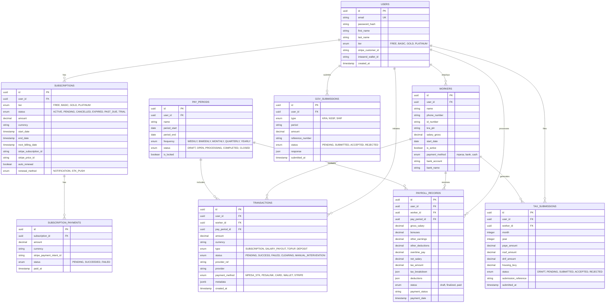

# Database Schema Design

## 1. ER Diagram



## 2. Table Definitions (SQL/PostgreSQL)

### Users Table
```sql
CREATE TYPE user_tier AS ENUM ('FREE', 'BASIC', 'GOLD', 'PLATINUM');

CREATE TABLE users (
    id UUID PRIMARY KEY DEFAULT gen_random_uuid(),
    email VARCHAR(255) UNIQUE NOT NULL,
    password_hash VARCHAR(255) NOT NULL,
    first_name VARCHAR(100),
    last_name VARCHAR(100),
    tier user_tier DEFAULT 'FREE',
    stripe_customer_id VARCHAR(255),
    created_at TIMESTAMP WITH TIME ZONE DEFAULT CURRENT_TIMESTAMP,
    updated_at TIMESTAMP WITH TIME ZONE DEFAULT CURRENT_TIMESTAMP
);
```

### Workers Table
```sql
CREATE TABLE workers (
    id UUID PRIMARY KEY DEFAULT gen_random_uuid(),
    user_id UUID NOT NULL REFERENCES users(id),
    name VARCHAR(255) NOT NULL,
    phone_number VARCHAR(20) NOT NULL, -- Encrypt in app layer if needed
    id_number VARCHAR(50), -- Encrypt in app layer
    kra_pin VARCHAR(50),
    salary_gross DECIMAL(12, 2) NOT NULL,
    start_date DATE NOT NULL,
    is_active BOOLEAN DEFAULT TRUE,
    created_at TIMESTAMP WITH TIME ZONE DEFAULT CURRENT_TIMESTAMP
);
```

### Transactions Table
```sql
CREATE TYPE transaction_type AS ENUM ('SUBSCRIPTION', 'SALARY_PAYOUT', 'TOPUP', 'DEPOSIT');
CREATE TYPE transaction_status AS ENUM ('PENDING', 'SUCCESS', 'FAILED', 'CLEARING', 'MANUAL_INTERVENTION');

CREATE TABLE transactions (
    id UUID PRIMARY KEY DEFAULT gen_random_uuid(),
    user_id UUID NOT NULL REFERENCES users(id),
    worker_id UUID REFERENCES workers(id), -- Null for subscription payments
    amount DECIMAL(12, 2) NOT NULL,
    currency VARCHAR(3) DEFAULT 'KES',
    type transaction_type NOT NULL,
    status transaction_status DEFAULT 'PENDING',
    provider_ref VARCHAR(255), -- M-Pesa Receipt Number or Stripe Charge ID
    metadata JSONB, -- Store extra details like failure reason
    created_at TIMESTAMP WITH TIME ZONE DEFAULT CURRENT_TIMESTAMP
);
```

## 3. Indexes & Performance
*   `CREATE INDEX idx_workers_user_id ON workers(user_id);`
*   `CREATE INDEX idx_transactions_user_id ON transactions(user_id);`
*   `CREATE INDEX idx_transactions_created_at ON transactions(created_at);`
