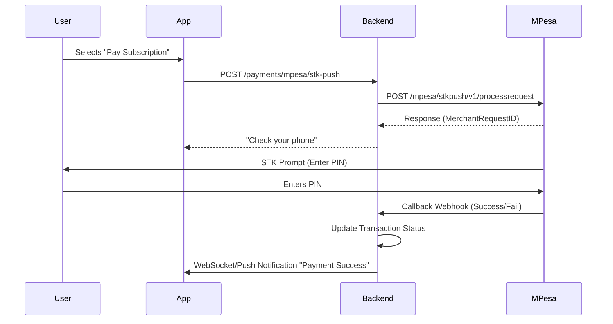
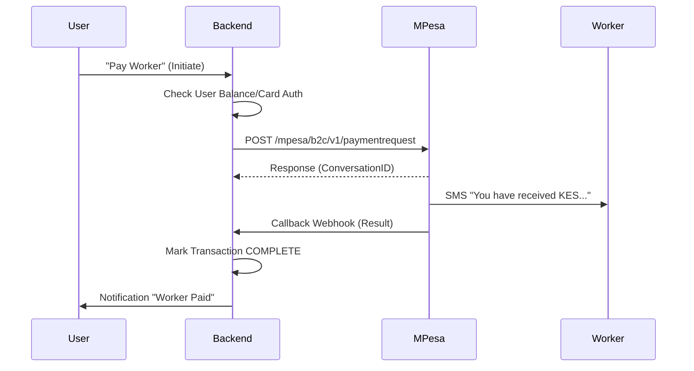

# M-Pesa Integration Strategy

## 1. Overview
The app requires two distinct M-Pesa flows:
1.  **Collection (C2B/STK Push)**: Receiving money from Users for Subscriptions or to fund their "Wallet" for payouts.
2.  **Payout (B2C)**: Sending money from the App's Business Account to Workers.

## 2. Authentication
*   **Endpoint**: `GET https://sandbox.safaricom.co.ke/oauth/v1/generate?grant_type=client_credentials`
*   **Headers**: `Authorization: Basic base64(ConsumerKey:ConsumerSecret)`
*   **Response**: Access Token (Valid for 1 hour).
*   **Strategy**: Cache the token in Redis. Refresh 5 minutes before expiry.

## 3. Collection Flow (STK Push)
Used when a user pays for a subscription or tops up their account.

### Sequence Diagram

### Implementation Details
*   **Endpoint**: `/mpesa/stkpush/v1/processrequest`
*   **Payload**:
    *   `BusinessShortCode`: Paybill/Till Number
    *   `Password`: Base64(ShortCode + Passkey + Timestamp)
    *   `Timestamp`: YYYYMMDDHHmmss
    *   `Amount`: KES Amount
    *   `PartyA`: User Phone Number
    *   `PartyB`: ShortCode
    *   `PhoneNumber`: User Phone Number
    *   `CallBackURL`: `https://api.paykey.com/payments/callbacks/mpesa`

## 4. Payout Flow (B2C)
Used to pay workers.

### Sequence Diagram

### Implementation Details
*   **Endpoint**: `/mpesa/b2c/v1/paymentrequest`
*   **CommandID**: `SalaryPayment` (Lower charges) or `BusinessPayment`.
*   **Security**: Requires a Security Credential (Certificate) from Safaricom portal.

## 5. Error Handling & Resilience

### Common Errors
*   **DS_TIMEOUT**: User didn't enter PIN in time. -> *Action*: Prompt user to retry.
*   **INS_SUFF_FUNDS**: User has no money. -> *Action*: Show error.
*   **SYSTEM_DELAY**: M-Pesa is slow. -> *Action*: Queue and poll status.

### Polling
If the Callback is not received within 30 seconds, initiate a status query.
*   **Endpoint**: `/mpesa/stkpushquery/v1/query`

## 6. Security Best Practices
1.  **Callback Validation**: Safaricom does not sign callbacks in Sandbox, but in Production, whitelist Safaricom IPs.
2.  **HTTPS**: Callbacks MUST be HTTPS.
3.  **Secrets**: Store Consumer Key, Secret, and Passkey in AWS Secrets Manager, NEVER in code.
